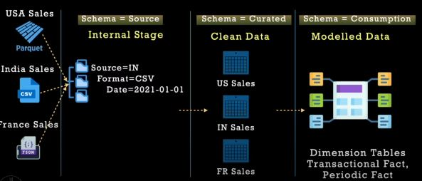
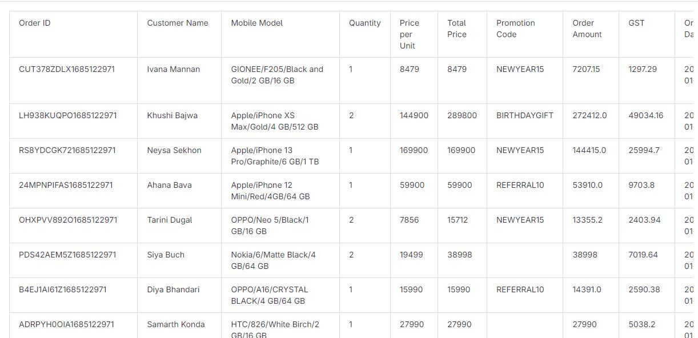
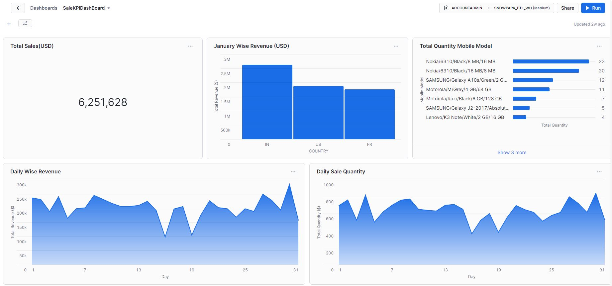
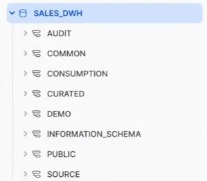
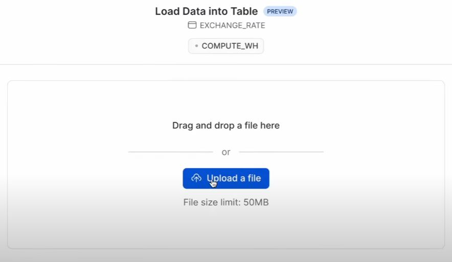
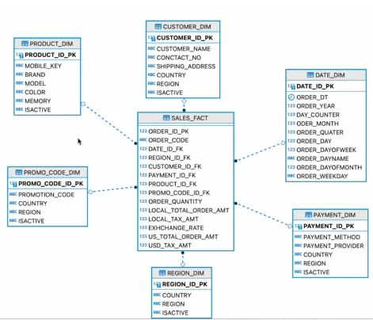

# AWS Sales Dashboard - Snowflake

### Flowchart



### Repo structure
```
├── python: 
│   ├── connect.py
│   ├── createstage.py
│   ├── curatedtoconsumption.py
│   ├── loadtosourceschema.py
│   ├── sourcetocurated_fr.py
│   ├── sourcetocurated_in.py
│   └── sourcetocurated_us.py
├── snowflake_sheet:
│   ├── 1.create virtual warehouse and user.txt
│   ├── 2. create database and schema.txt
│   ├── 3.create internal stage.txt
│   ├── 4. create file formats.txt
│   ├── 4. view data.txt
│   ├── 5. load forex data.txt
│   ├── 6. create sequence.txt
│   ├── 6. from stage to source.txt
│   ├── 7. source to curated.txt
│   └── 8. curated to consumption.txt
```

## **Dataset**
- Data get from [tutorial](https://www.youtube.com/watch?v=1jC98XQwBZw)
- I install data from [link](https://gitlab.com/toppertips/snowflake-work/-/blob/main/snowpark-example/end2end-sample-data/3-region-sales-data.zip)




- Final result after doing follow tutorial :


## I.How-to-Guide

### 1. Manage user and grant
#### 1.1 Creating user and virtual warehouse
- Sheetbook is stored in folder snowflake_sheet
- For simple,  i only create role sysadmin and grant to user snowpark_user (```1.create virtual warehouse and user```)
- In practice, you can add some roles like securityadmin,useradmin, Sales Role, HR Roles
- I create snowpark_user with password="Test@12$4" ,the user is used to connect with snowpark and apply preprocessing,processing with support of various libary as pandas,.. in python. 
- Create Virtual Machine with scaling_policy='standard', but for saving, i think can use scaling_policy='economy'
#### 1.2 Check connection
- Use ```connect.py```
- Adjust account name and run that,the code is simplifying using snowpark.
- Command using is:
  ```
    session.sql("SQL code")
  ```
- Result:
- 
  

### 2. Initialize
#### 2.1 Creating database and schema
- Create many schemas which we need: Source, Curated,Consumption,Audit,Common(```2. create database and schema```)
- After run code ,the result like:
  
   
   
#### 2.2 Create Internal Stage
- Create internal stage to store three data of three region in IN,FR,US. (```3.create internal stage```)
- Download data from local,using snowflake transform data and push it to internal stage (```createstage.py```)
- Because the different between type format,we create partion stage to storage each of that.
- Using command ```LIST @stage_location``` to check data is exist.
#### 2.3 Create File Format
- Using common schema,to create three file format (```4. create file formats```)
- To view the data, use file format to view data in internal stage (```4. view data```)
#### 2.4 Load Forex Data
- Using schema common, create table exchange rate.(```5. load forex data```)
- After createing,click on table and click load data
   

### 3. Loading
#### 3.1 From stage to source
- Create sequence to number a record in table(```6. create sequence```)
- Create table fr_sale_oder,in_sales_order ,us_sales_order in schema Source(```6. from stage to source```)
- Using snowpark(```loadtosourceschema.py```) to load data from stage to source
- Command ```copy into table from table" is using, add METADATA$FILENAME,METADATA$FILE_ROW_NUMBER,METADATA$LAST_MODIFIED to more specify

#### 3.2 From source to curated
- In this step, we will transformation combine mapping exchange_rate,filter data with unique,..
- First create table in schema curated(```7. source to curated```)
- Run code ```sourcetocurated_fr.py, sourcetocurated_in.py,sourcetocurated_us.py``` to extract transform and load to curated
- The script connects to Snowflake, loads sales data, and filters it to include only "Paid" and "Delivered" orders. It then enriches the data by adding country and region columns, joins it with exchange rate data, and removes duplicates. Finally, it computes additional fields like US_TOTAL_ORDER_AMT,.. and saves the processed data into a new table.

#### 3.3 From curated to consumption
- In consumption, we create table need for requirement.
- Database Schema, we create like:

   
   
- Code create table(```8. curated to consumption```)
- Using ```curatedtoconsumption.py``` to extract transform load from curated to consumption


